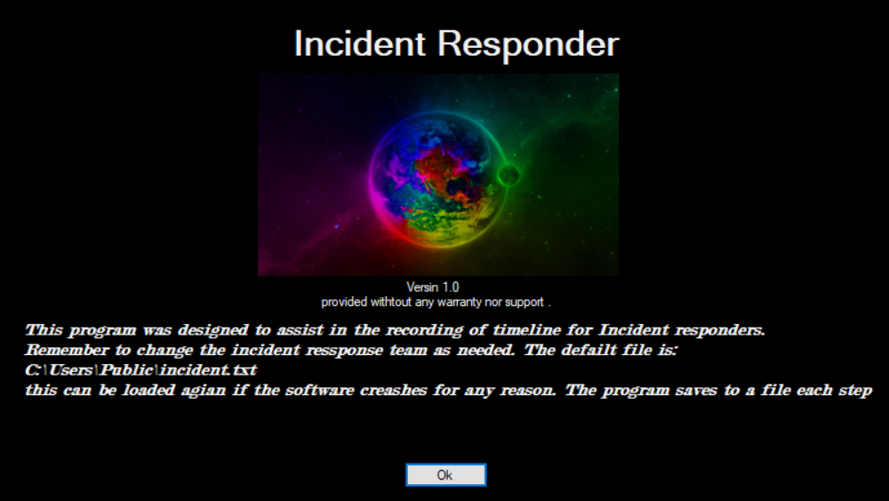
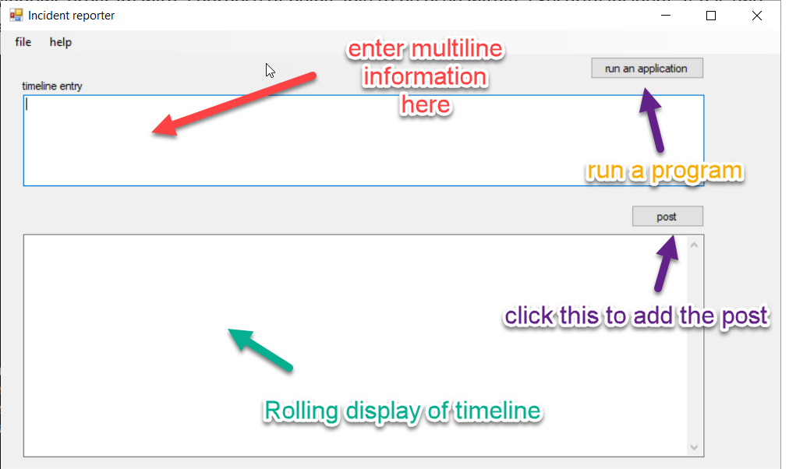
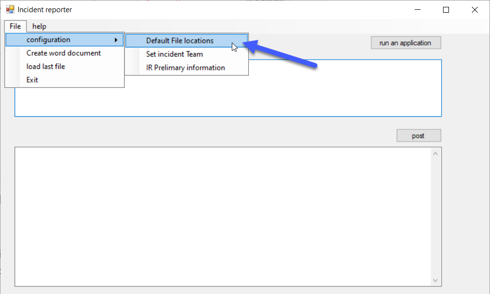
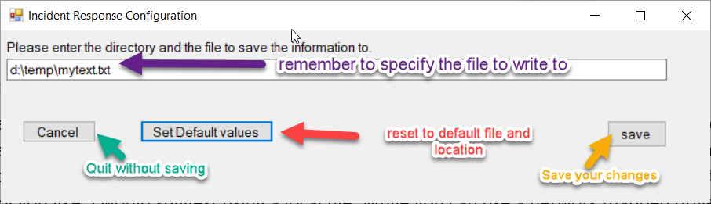
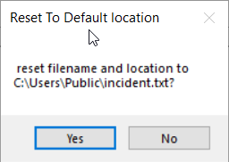

# Incident Recorder (part of Incident Responder)
This is a simple windows program with a purpose of being able to be used within a Security incident. It has Three files, a main program, a configuration file and the license file(Gnu General Public), If you use this program you will need all three. ***By using this program you also agree to the terms of the GNU General Public License. IF you do not agree with the license terms and conditions, do not use this program.

*Note: the name of the program is Incident responder, the first release is just the incident recorder piece of the application. As I mature the parent application, I plan to add features like forensic gathering, email, etc. Each will have a standalone version. I am using this project to learn C#. this release uses the .net framework. It's only been tested on 2 computers.

The main focus is the timeline entry.

Initial Setup

# Initial Setup

The first thing to adjust is the File location. This is where the rolling
information is contained. This is found in File\>Configuration\> Default File
locations. (see below)

When you click this menu item, you are presented with a window for where the
information should be saved. Right now, it’s a simple Text File with no
formatting. Also, when you start the program it automatically defaults to
c:\\Users\\Public\\incident.txt. you can change it from this location to where
ever you like. I would suggest using a local file location. While you can use a
network mapped drive, the application writes to this file constantly to avoid
losing any data. Below is an example of a local drive. Note: you need to tell it
the file also if you are not using the default values.

When you select the “set Default Values” it will revert back to
“c:\\Users\\Public\\Incident.txt” After prompting you.

Note: changes made in this window are not saved until you save your changes with
the Save button.

Once saved the file location is written to the config file, This is the default
location for all configuration information including the Preliminary and
Incident team data.
# New Beta testing release 1.3 in downloads
there is a new beta testing release in downloads. as of 3/31/22 I plan to move this to full release at the end of April.
