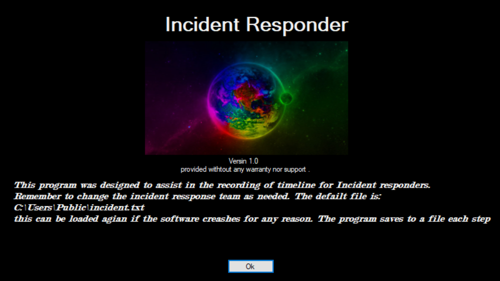
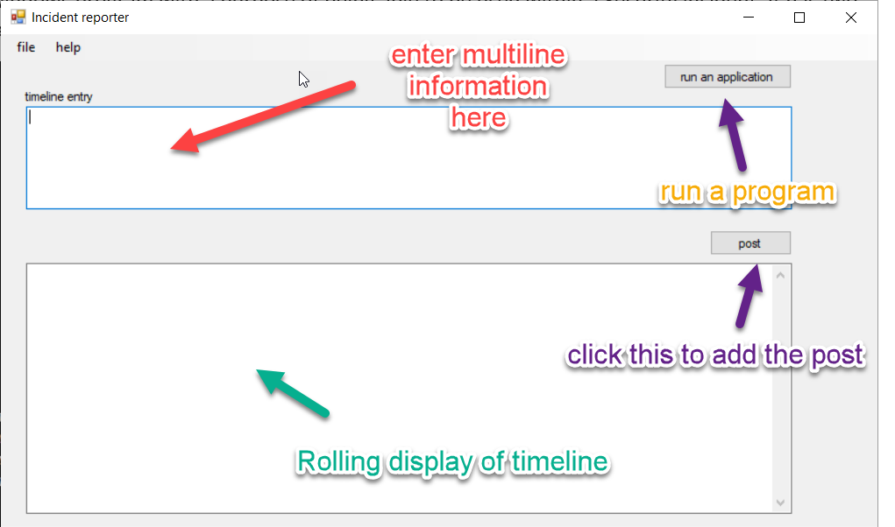
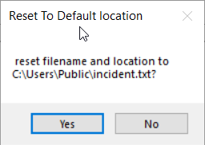

# Incident Recorder

This is a windows program with a purpose of being able to be used within a
Security incident. It has two files, a main program, and a configuration.

The main focus is the timeline entry.

Initial Setup

# Initial Setup

The first thing to adjust is the File location. This is where the rolling
information is contained. This is found in File\>Configuration\> Default File
locations. (see below)

When you click this menu item, you are presented with a window for where the
information should be saved. Right now, it’s a simple Text File with no
formatting. Also, when you start the program it automatically defaults to
c:\\Users\\Public\\incident.txt. you can change it from this location to where
ever you like. I would suggest using a local file location. While you can use a
network mapped drive, the application writes to this file constantly to avoid
losing any data. Below is an example of a local drive. Note: you need to tell it
the file also if you are not using the default values.

When you select the “set Default Values” it will revert back to
“c:\\Users\\Public\\Incident.txt” After prompting you.

Note: changes made in this window are not saved until you save your changes with
the Save button.

Once saved the file location is written to the config file, This is the default
location for all configuration information including the Preliminary and
Incident team data.
